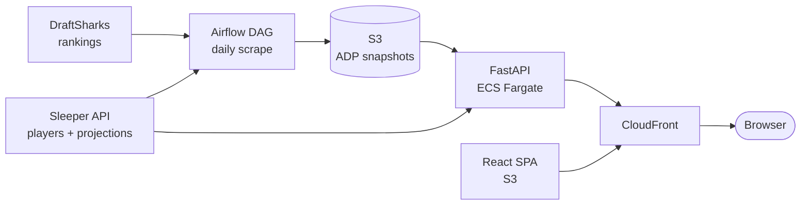

# LineupLines Live at [lineuplines.com](https://lineuplines.com)**

Built for new drafters who want a clear answer on who to take next, with the ADP,
VOR, and positional depth numbers experienced drafters expect underneath.

## What it does

- **Follows a live draft.** Enter a Sleeper username, pick an active draft, and
  the board updates as picks come in over server-sent events.
- **Flags value and reach.** Every pick is compared to average draft position.
  A player taken later than their ADP is value; earlier is a reach.
- **Ranks by Value Over Replacement.** VOR scores each available player against
  the last startable player at their position, so a WR and a TE can be compared
  on one scale.
- **Tracks your roster.** Shows what you've drafted, what you still need, and
  the best available player at each position.

## Architecture



The API runs as a container on ECS Fargate behind an Application Load Balancer.
The React app is a static build in S3, and CloudFront sits in front of both,
serving the SPA from the bucket and routing `/api/*` and `/health` to the load
balancer. Analytics events go to DynamoDB, user feedback goes out through SES,
and player and ADP data live in S3.

There is no relational database. Nothing in the app needs one, so adding
Postgres would have meant paying for and maintaining a service that stores what
a few JSON documents already hold.

Live drafts stream over SSE, which took some infrastructure care: the ALB idle
timeout is raised to an hour and CloudFront compression is disabled on the API
behaviors, since buffering breaks a streaming response.

## Data pipeline

ADP is the number the whole app leans on, and DraftSharks publishes it as HTML
rather than an API. An Airflow DAG (`airflow/dags/adp_scrape_dag.py`) handles
ingestion on a daily schedule, running on ECS Fargate from an Astronomer runtime
image.

The DAG fans out into one task group per ranking key, covering 13 keys: redraft
in PPR, half-PPR, and standard, plus dynasty, keeper, and auction variants. Each
group runs the same four steps:

1. **Scrape** the ranking page with headless Chromium.
2. **Validate** before anything is written. A scrape is rejected if it returns
   fewer than 100 players, if any ADP falls outside 1.0 to 500.0, or if more
   than 20% of players are missing an ADP. A silently truncated scrape is worse
   than no scrape, because the API would serve it as real data.
3. **Cross-reference** the scraped names against the Sleeper player universe.
   The two sources share no common identifier, so the join is on normalized name
   plus position.
4. **Write** the validated result to S3 at
   `adp/draftsharks/{ranking_key}/latest.json`, in a version-enabled bucket.

Failures alert to Slack. The API reads these snapshots at request time and falls
back to ADP derived from Sleeper projections if one is missing, returning
`adp_source_available=false` so the client can say so rather than quietly showing
different numbers.

**Current status:** snapshots were refreshed through the preseason drafting
window, and the scheduler service is now parked at `desired_count=0`. Nobody
drafts once the season starts, and an idle Fargate task still costs money.
Snapshots can be refreshed independently of the scheduler with
`scripts/upload_draftsharks_adp_snapshot.py`, which scrapes and writes the same
snapshot format the DAG produces.

Reviving it for next preseason means flipping that count and fixing a known bug
noted in `infra/terraform/variables.tf`: the DAG re-pauses on every restart,
because the SQLite metadata database on EFS does not persist that state and
Airflow pauses new DAGs at creation by default.

## Tech stack

- **Backend:** Python 3.10, FastAPI, Pydantic, uvicorn
- **Frontend:** React 19, Vite, Tailwind CSS, React Router 7
- **Pipeline:** Apache Airflow 2 on the Astronomer runtime, Selenium, BeautifulSoup
- **Infrastructure:** Terraform, Docker, GitHub Actions
- **AWS:** ECS Fargate, ALB, S3, CloudFront, DynamoDB, SES, Route 53, ECR, EFS

## Quick start

```bash
# Backend
pip install -r requirements.txt
python scripts/sync_player_data.py   # Fetch the Sleeper player universe
python scripts/run_api.py            # API server on :8000

# Frontend (from frontend/)
npm install
npm run dev                          # Dev server on :3000, proxies to :8000
```

Interactive API docs are at `http://localhost:8000/docs` once the server is up.

### Docker

```bash
python scripts/sync_player_data.py   # Populate data/ first
docker build -t lineuplines-api:latest .
docker run -p 8000:8000 lineuplines-api:latest
```

## Tests

```bash
pytest tests/ -v
pytest tests/ --cov=src
```

174 tests across 16 files, covering the API endpoints, the ADP source registry
and its S3 fallback behavior, the storage layer, rate limiting, and the Sleeper
client. Sleeper is mocked at `src.api.main.sleeper_client.<method>`, so no test
depends on a live third-party API. A further 6 DAG-integrity tests run against
the Airflow project in its own workflow.

## Deployment

Three path-filtered GitHub Actions workflows cover the backend, frontend, and
Airflow project. Each runs its tests on pull requests and deploys on merge to
`main`: the backend builds and pushes to ECR then updates the ECS service, the
frontend syncs to S3 and invalidates CloudFront, and the Airflow image is rebuilt
and its service recreated.

All three authenticate to AWS through GitHub OIDC, so there are no long-lived
access keys stored as repository secrets. Infrastructure lives in
`infra/terraform/` across nine modules with remote state in S3, and is applied
manually rather than from CI.

## Repo layout

```text
src/            FastAPI app, Sleeper and DraftSharks clients, VOR and ADP services
frontend/       React SPA
airflow/        ADP scrape DAG, source plugins, Astronomer project
infra/          Terraform modules for the AWS stack
scripts/        Local data sync, snapshot upload, deploy helpers
tests/          pytest suite
research/       Offline backtest harness for a start/sit model (exploratory,
                not wired into the app)
docs/           Extended documentation
```

## Documentation

- [API Reference](docs/API.md) — endpoints and example responses
- [Architecture](docs/ARCHITECTURE.md) — design decisions and patterns
- [AWS Deployment](docs/AWS_DEPLOYMENT.md) — the production setup and why
- [Testing](docs/TESTING.md) — mocking strategy and test organization
- [Frontend Tech Stack](docs/FRONTEND_TECH_STACK.md) — components and hooks

<!-- PREVIOUS README — retained for review, safe to delete (git history has it).

# LineupLines

Fantasy football draft helper that integrates with [Sleeper](https://sleeper.com) for live draft tracking, scrapes [FantasyPros](https://www.fantasypros.com) for ADP data, and provides VOR (Value Over Replacement) analysis to identify value picks in real time.

## Tech Stack

- **Backend**: FastAPI + Python (Pydantic models, uvicorn)
- **Frontend**: React 19 + Vite + Tailwind CSS + React Router v7
- **Data**: Sleeper API integration + FantasyPros ADP scraping + local JSON storage

## Quick Start

```bash
# Backend
pip install -r requirements.txt
python scripts/sync_player_data.py   # Fetch player data
python scripts/run_api.py            # API server on :8000

# Frontend (from frontend/)
npm install
npm run dev                          # Dev server on :3000 (proxies to :8000)
```

### Docker (Local Testing)

```bash
python scripts/sync_player_data.py   # Ensure data/ is populated first
docker build -t draft-helper:latest .
docker run -p 8000:8000 draft-helper:latest
```

## API Docs

Interactive docs at `http://localhost:8000/docs` (Swagger UI) when the server is running.

## Documentation

See [`docs/`](docs/) for detailed documentation:
- [API Reference](docs/API.md) — All 13 endpoints with examples
- [Architecture](docs/ARCHITECTURE.md) — Design decisions and patterns
- [Deployment](docs/DEPLOYMENT.md) — Local dev, Docker, and production setup
- [Testing](docs/TESTING.md) — 88 tests, mocking strategy, test organization
- [Frontend Tech Stack](docs/FRONTEND_TECH_STACK.md) — React components and hooks

-->
